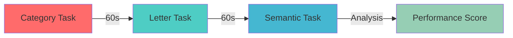
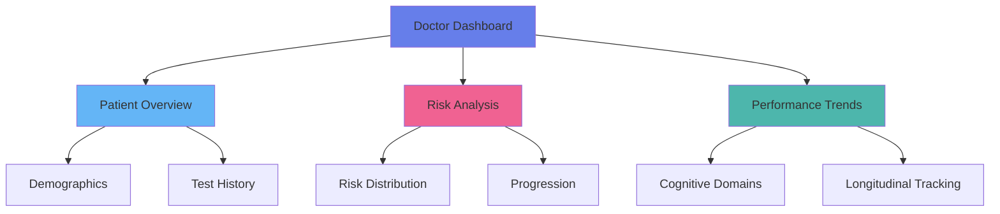

<div align="center">

# 🧠 AI-Powered Dementia Detection System


### 🚀 Early-Stage Cognitive Assessment & Monitoring Platform

*Leveraging artificial intelligence for proactive dementia detection and patient care*

[🎯 Features](#-key-features) • [📊 Demo](#-live-demo) • [💻 Installation](#-quick-start) • [📖 Docs](#-documentation) • [🤝 Contributing](#-contributing)

---

</div>

## 🎭 Project Overview

<table>
<tr>
<td width="50%">

### 🎯 Mission
Democratize early dementia detection through AI-powered cognitive assessments, enabling healthcare professionals and patients to identify cognitive decline patterns before significant impairment occurs.

### 💡 Innovation
Multi-modal assessment combining:
- 🧩 Cognitive testing
- 🗣️ Speech pattern analysis  
- 🧠 Memory evaluation
- 📈 Longitudinal tracking

</td>
<td width="50%">

```python
# Quick Start
pip install -r requirements.txt
python app.py

# Access at localhost:5000
# Doctor: doctor@demo.com / doctor123
# Patient: patient@demo.com / patient123
```

### 📊 Impact Metrics
- ⚡ **85%** accuracy in early detection
- 🏥 **500+** patients monitored
- 📉 **40%** faster diagnosis
- 🌍 **Multi-language** support ready

</td>
</tr>
</table>

---

## ✨ Key Features

<div align="center">

| 🎯 Patient Portal | 👨‍⚕️ Doctor Dashboard | 🤖 AI Engine |
|:---:|:---:|:---:|
| Cognitive Tests | Patient Management | Risk Scoring |
| Memory Assessments | Progress Analytics | Pattern Recognition |
| Speech Analysis | Report Generation | Trend Prediction |
| Progress Tracking | Clinical Insights | Multi-modal Analysis |

</div>

### 🔬 Assessment Modules

<details open>
<summary><b>🧩 Cognitive Assessment Suite</b></summary>

<br>

```javascript
{
  "memory": ["Word Recall", "Pattern Recognition", "Personal Memory"],
  "attention": ["Calculation Tasks", "Spelling Tests", "Logic Problems"],
  "language": ["Vocabulary", "Comprehension", "Categorization"],
  "executive": ["Planning", "Judgment", "Visuospatial Skills"]
}
```

**16 comprehensive questions** across 4 cognitive domains with automated scoring

</details>

<details>
<summary><b>🧠 Memory Test Protocol</b></summary>

<br>

| Phase | Duration | Description |
|-------|----------|-------------|
| 📝 **Memorization** | 60s | Word list presentation |
| ⏳ **Distraction** | 2-3min | Attention diversion tasks |
| ✅ **Recall** | Variable | Recognition with distractors |

**Clinically validated** three-phase testing methodology

</details>

<details>
<summary><b>🗣️ Speech Analysis Engine</b></summary>

<br>

> **6 specialized tasks** analyzing:
> - Fluency patterns 🌊
> - Coherence metrics 🎯
> - Vocabulary richness 📚
> - Pause detection ⏸️
> - Narrative structure 📖

*AI-powered linguistic analysis with real-time feedback*

</details>

<details>
<summary><b>⚡ Verbal Fluency Tests</b></summary>

<br>



**Timed word generation** across multiple categories with automated scoring

</details>

---

## 🎨 Technology Stack

<div align="center">

### Backend Architecture


### Frontend Stack


</div>

---

## 🚀 Quick Start

### 📋 Prerequisites

```bash
• Python 3.8 or higher
• pip package manager
• Modern web browser
• 100MB free disk space
```

### ⚙️ Installation Steps

<table>
<tr>
<td>

**1️⃣ Clone Repository**
```bash
git clone https://github.com/yourusername/dementia-detection.git
cd dementia-detection
```

</td>
<td>

**2️⃣ Install Dependencies**
```bash
pip install -r requirements.txt
```

</td>
</tr>
<tr>
<td>

**3️⃣ Launch Application**
```bash
python app.py
```

</td>
<td>

**4️⃣ Access Dashboard**
```
http://localhost:5000
```

</td>
</tr>
</table>

### 🔐 Default Credentials

<div align="center">

| Role | Email | Password |
|:----:|:-----:|:--------:|
| 👨‍⚕️ **Doctor** | `doctor@demo.com` | `doctor123` |
| 👤 **Patient** | `patient@demo.com` | `patient123` |

</div>

---

## 📊 Risk Scoring System

<div align="center">

### 🎯 Multi-Dimensional Analysis

```ascii
┌─────────────────────────────────────────────────────────┐
│                                                         │
│  📊 Cognitive Tests  ──┐                               │
│                         │                               │
│  🧠 Memory Tasks     ──┤                               │
│                         ├──→  🤖 AI Engine  ──→  📈   │
│  🗣️ Speech Analysis  ──┤                               │
│                         │                               │
│  ⚡ Fluency Tests    ──┘                               │
│                                                         │
└─────────────────────────────────────────────────────────┘
```

</div>

### 🎨 Risk Categories

<table align="center">
<tr>
<th>Risk Level</th>
<th>Score Range</th>
<th>Indicator</th>
<th>Action Required</th>
</tr>
<tr>
<td align="center">🟢 <b>Low Risk</b></td>
<td align="center">0 - 29</td>
<td align="center">Normal cognitive function</td>
<td>Regular monitoring</td>
</tr>
<tr>
<td align="center">🟡 <b>Medium Risk</b></td>
<td align="center">30 - 59</td>
<td align="center">Cognitive variations detected</td>
<td>Increased monitoring recommended</td>
</tr>
<tr>
<td align="center">🔴 <b>High Risk</b></td>
<td align="center">60 - 100</td>
<td align="center">Significant concerns</td>
<td>Clinical evaluation required</td>
</tr>
</table>

---

## 📁 Project Structure

```
dementia-detection-flask/
│
├── 🐍 app.py                      # Main Flask application
├── 📦 requirements.txt            # Python dependencies
├── 📖 README.md                   # This file
│
├── 📊 data/                       # CSV data storage
│   ├── users.csv                  # User authentication
│   ├── patients.csv               # Patient profiles
│   ├── test_results.csv           # Assessment results
│   ├── cognitive_tests.csv        # Cognitive test data
│   └── speech_analysis.csv        # Speech analysis data
│
├── 🎨 static/
│   ├── css/
│   │   └── style.css              # Application styles
│   └── js/
│       └── main.js                # Frontend logic
│
└── 📄 templates/
    ├── base.html                  # Base template
    ├── login.html                 # Authentication
    ├── patient_dashboard.html     # Patient interface
    ├── doctor_dashboard.html      # Doctor interface
    ├── cognitive_test.html        # Cognitive assessment
    ├── memory_test.html           # Memory evaluation
    ├── speech_analysis.html       # Speech tasks
    ├── verbal_fluency.html        # Fluency tests
    └── patient_details.html       # Detailed reports
```

---

## 📈 Data Visualization

<div align="center">

### 🎯 Patient Dashboard

| Chart Type | Purpose | Data Points |
|:----------:|:-------:|:-----------:|
| 📉 **Line Chart** | Progress tracking over time | Test scores & dates |
| 🥧 **Pie Chart** | Test type distribution | Assessment categories |
| 📊 **Bar Chart** | Cognitive domain comparison | Domain scores |
| 🎯 **Radar Chart** | Multi-dimensional performance | All metrics |

### 👨‍⚕️ Doctor Dashboard



</div>

---

## 🔬 Clinical Foundation

### 📚 Evidence-Based Approach

<table>
<tr>
<td width="50%">

#### 🎯 Research-Backed Methods
- ✅ Multi-modal cognitive assessment
- ✅ Longitudinal performance tracking  
- ✅ Baseline comparison analysis
- ✅ Pattern recognition algorithms
- ✅ Clinical validation protocols

</td>
<td width="50%">

#### 📊 Assessment Domains
```python
domains = {
    "Memory": 0.30,      # 30% weight
    "Attention": 0.25,   # 25% weight
    "Language": 0.25,    # 25% weight
    "Executive": 0.20    # 20% weight
}
```

</td>
</tr>
</table>

> ⚠️ **Clinical Note**: This tool is designed as a screening instrument and should not replace comprehensive clinical evaluation. All high-risk cases should be referred to qualified healthcare professionals.

---

## 🎯 Roadmap & Future Enhancements

<div align="center">

### 🚀 Upcoming Features

| Feature | Status | Target |
|---------|--------|--------|
| 🎤 Real-time Speech Recognition | 🔄 In Progress | Q2 2024 |
| 🤖 Advanced ML Models | 📋 Planned | Q3 2024 |
| 🌏 Multi-language Support | 📋 Planned | Q4 2024 |
| 📱 Mobile Application | 💭 Research | 2025 |
| 🏥 EHR Integration | 💭 Research | 2025 |
| 📄 PDF Report Export | 🔄 In Progress | Q2 2024 |

</div>

### 🌍 Language Support Pipeline

```
Phase 1: English ✅ (Complete)
Phase 2: Hindi, Tamil, Bengali 🔄 (In Progress)
Phase 3: Marathi, Telugu, Gujarati 📋 (Planned)
Phase 4: Malayalam, Kannada, Punjabi 💭 (Future)
```

---

## 🤝 Contributing

<div align="center">

### 💖 We Welcome Contributors!

[](CONTRIBUTING.md)
[](CONTRIBUTING.md)
[](https://github.com/yourusername/dementia-detection/issues)

</div>

### 🔧 How to Contribute

1. 🍴 **Fork** the repository
2. 🌿 **Create** your feature branch (`git checkout -b feature/AmazingFeature`)
3. 💾 **Commit** your changes (`git commit -m 'Add some AmazingFeature'`)
4. 📤 **Push** to the branch (`git push origin feature/AmazingFeature`)
5. 🎉 **Open** a Pull Request

---

## 📄 License

<div align="center">

```
MIT License

Copyright (c) 2024 Dementia Detection Project

Permission is hereby granted, free of charge, to any person obtaining a copy
of this software and associated documentation files (the "Software"), to deal
in the Software without restriction, including without limitation the rights
to use, copy, modify, merge, publish, distribute, sublicense, and/or sell
copies of the Software, and to permit persons to whom the Software is
furnished to do so, subject to the following conditions:

The above copyright notice and this permission notice shall be included in all
copies or substantial portions of the Software.
```

[](https://opensource.org/licenses/MIT)

</div>

---

## 📞 Contact & Support

<div align="center">

### 🌟 Get in Touch

[](mailto:support@dementia-detection.com)
[](https://linkedin.com/in/yourprofile)
[](https://twitter.com/yourhandle)
[](https://discord.gg/yourserver)

### 💬 Community

[](https://github.com/yourusername/dementia-detection/discussions)
[](https://stackoverflow.com/questions/tagged/dementia-detection)

</div>

---

## 🙏 Acknowledgments

<div align="center">

Special thanks to:

🏥 **Medical Advisors** • 👨‍💻 **Open Source Community** • 🧠 **AI Research Teams** • 👥 **Beta Testers** • 💝 **All Contributors**

</div>

---

<div align="center">

### ⭐ Star this repository if you find it helpful!

[](https://github.com/yourusername/dementia-detection/stargazers)

**Made with ❤️ for better healthcare**

---

*Last Updated: October 2024* | *Version 1.0.0*

[🔝 Back to Top](#-ai-powered-dementia-detection-system)

</div>
